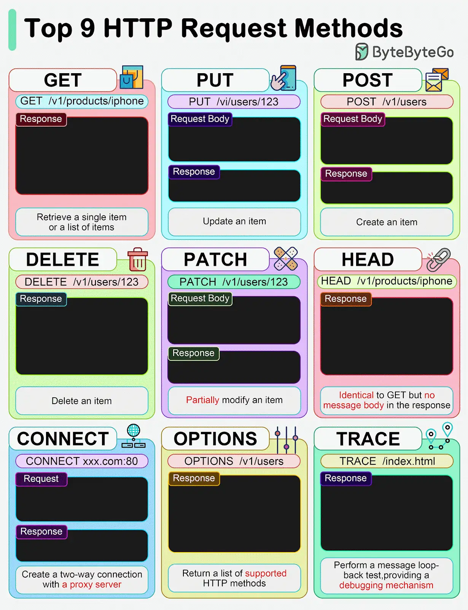

GET, POST, PUT... Common HTTP “verbs” in one figure. Next week's topics will be listed at the end.
 
1. HTTP GET 
This retrieves a resource from the server. It is idempotent. Multiple identical requests return the same result. 
 
2. HTTP PUT 
This updates or Creates a resource. It is idempotent. Multiple identical requests will update the same resource. 
 
3. HTTP POST 
This is used to create new resources. It is not idempotent, making two identical POST will duplicate the resource creation. 
 
4. HTTP DELETE 
This is used to delete a resource. It is idempotent. Multiple identical requests will delete the same resource. 
 
5. HTTP PATCH 
The PATCH method applies partial modifications to a resource. 
 
6. HTTP HEAD 
The HEAD method asks for a response identical to a GET request but without the response body. 
 
7. HTTP CONNECT 
The CONNECT method establishes a tunnel to the server identified by the target resource. 
 
8. HTTP OPTIONS 
This describes the communication options for the target resource. 
 
9. HTTP TRACE 
This performs a message loop-back test along the path to the target resource.

