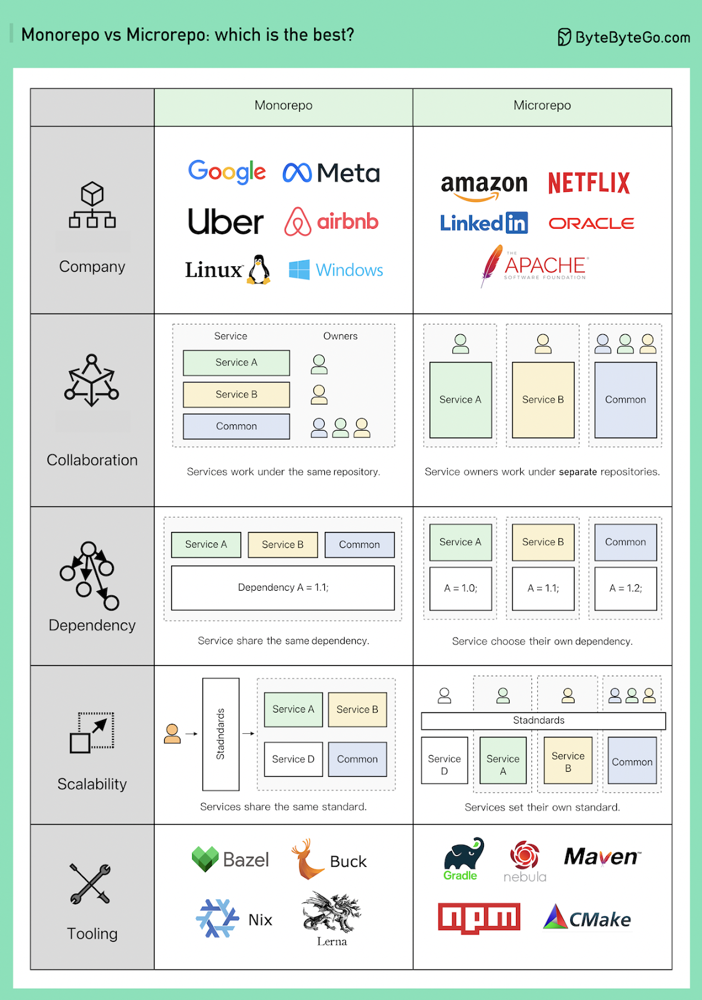

Do you believe that Google, Meta, Uber, and Airbnb put almost all of their code in one repository? 
 
This practice is called a monorepo. 
 
Monorepo vs. Microrepo. Which is the best? Why do different companies choose different options? 
 
Monorepo isn't new; Linux and Windows were both created using Monorepo. To improve scalability and build speed, Google developed its internal dedicated toolchain to scale it faster and strict coding quality standards to keep it consistent. 
 
Amazon and Netflix are major ambassadors of the Microservice philosophy. This approach naturally separates the service code into separate repositories. It scales faster but can lead to governance pain points later on. 
 
Within Monorepo, each service is a folder, and every folder has a BUILD config and OWNERS permission control. Every service member is responsible for their own folder. 
 
On the other hand, in Microrepo, each service is responsible for its repository, with the build config and permissions typically set for the entire repository. 
 
In Monorepo, dependencies are shared across the entire codebase regardless of your business, so when there's a version upgrade, every codebase upgrades their version. 
 
In Microrepo, dependencies are controlled within each repository. Businesses choose when to upgrade their versions based on their own schedules. 
 
Monorepo has a standard for check-ins. Google's code review process is famously known for setting a high bar, ensuring a coherent quality standard for Monorepo, regardless of the business. 
 
Microrepo can either set their own standard or adopt a shared standard by incorporating best practices. It can scale faster for business, but the code quality might be a bit different. 
 
Google engineers built Bazel, and Meta built Buck. There are other open-source tools available, including Nix, Lerna, and others. 
 
Over the years, Microrepo has had more supported tools, including Maven and Gradle for Java, NPM for NodeJS, and CMake for C/C++, among others. 
 
Over to you: Which option do you think is better? Which code repository strategy does your company use? 

-- 
Subscribe to our weekly newsletter to get a Free System Design PDF (158 pages): https://bit.ly/3KCnWXq
